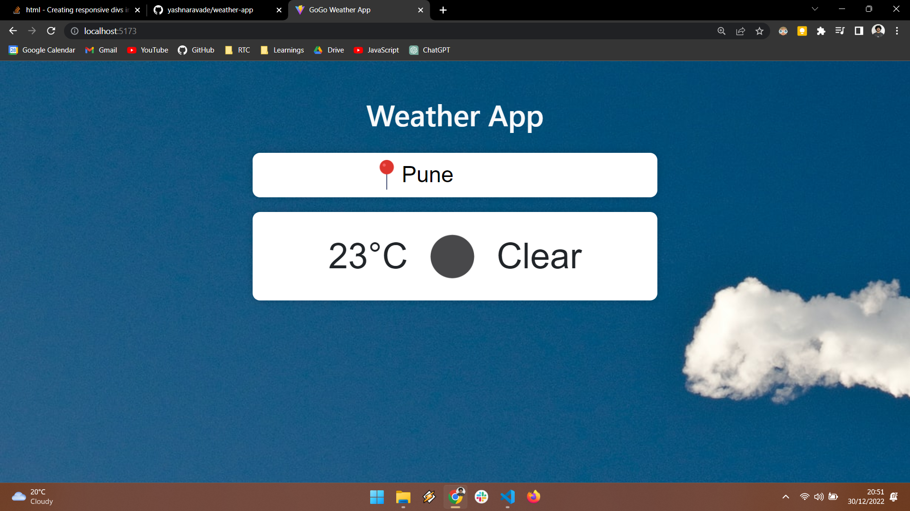

# weather-app

This is a simple weather app that uses the OpenWeatherMap API to get the current weather for a given city. It is built using React and Vite.

## Screenshot

## Live Demo

[https://weather-app-flame-eta.vercel.app/](https://weather-app-flame-eta.vercel.app/)
